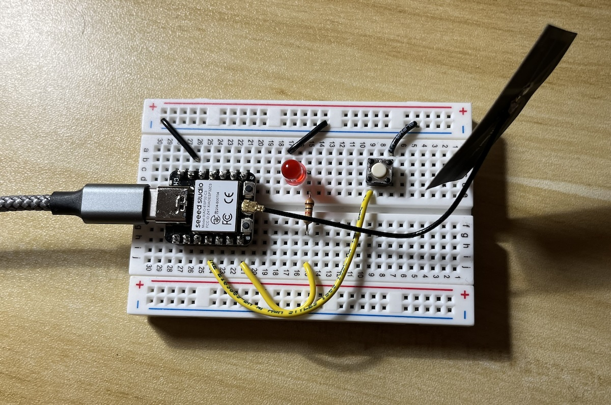

# Maker Exchange Network
This is a side project from the Haystack "Maker Exchange" Residency at the Fab Lab. The idea is to create a network of devices that can be installed in makerspaces, Fab Labs, and other similar spaces and send simple messages to one another. The messages are intended to trigger some physical device installed in the lab, like an LED, that will blink or glow whenever a message is sent on the network.

## Contributers
- James Rutter
- Rob Hart 
- Janet Hollingsworth 
- Zach Fredin 
- Phoebe Zildjian 

## Partner Organizations
- Haystack Mountain School of Crafts
- The Possible Zone 

Interested in joining the network? Please email fablab@haystack-mtn.org for more information about this project and how to participate. 

For the full documentation, please visit ... 

# Getting Started 

## Supported Devices
- XIAO ESP32-C3
*More chipsets will be tested and added to this list in the future.*

## Circuit 
To get started you will need to build a simple LED and button circuit connected to the ESP32-C3. Please visit the full documentation for more information on building this circuit.  

## MicroPython
This project uses MicroPython as an alternative to Arduino. While future versions of this may include Arduino support, we decided on using MicroPython for several reasons. MicroPython opens the door to programming microcontrollers with Python, which is a high level programming language known for being beginner friendly and extremely readable. We have worked quite extensively with Arduino and wanted to explore new pathways for working with devices like the XIAO ESP32-C3. 

## Code
`client-ESP32C3.py` is the MicroPython starter file for creating a new maker exchange device. You will need to load the code onto a ESP32-C3 board, and is recommended that you use [Thonny](https://thonny.org/) or [esptool](https://docs.espressif.com/projects/esptool/en/latest/esp32/) to do this. This starter file does two things: 
1. Sends (publish) the default maker exchange network message when button is pressed. The LED will also turn on to indicate that a message has been sent. 
2. Receive (subscribe) any incoming messages on the maker exhange network and light up the LED when the message is received. To test this, you would need to connect a 2nd device to send a message. 

## Setup 
There are several properties that you need to configure in order for the device to work. 

### WiFi
Enter the correct credentials for the network you are going to run the device on. 
- `WIFI_SSID`
- `WIFI_PASSWORD`

### HiveMQ Details 
We are using a cloud-hosted MQTT broker, [HiveMQ](https://www.hivemq.com/), which provides a generous free-tier and will likely handle most of the performance needs of this project while it is still in a small development state. Below is the specific information you will need in order to connect a device to the Maker Exchange Network: 

`MQTT_BROKER = '80cd98a8ff724b559bad56104395d810.s1.eu.hivemq.cloud'`

`MQTT_PORT = 0` 

*Please note that the default TLS port is 8883, however, due to the MQTT client library used for MicroPython, it is required to set to 0.* 

`MQTT_USER` & `MQTT_PASSWORD` are provided to you by the network coordinator. Please email fablab@haystack-mtn.org to requst an account. 

## Run 
In Thonny, you will need to ensure that the device is connected via USB and then click on the RUN button in the top menu bar. Later on, you can use an external power source and have the device run independent from the computer. This README does not go into how to flash MicroPython firmware, please visit the full documentation website for this. 

## Topic Structure 
`maker-exchange/{org-id}/{device-id}/{message-type}`

## Payload Structure 

# Development Roadmap 
- Possibly add a OLED screen for reading out MQTT message content, animations, or emojis :smile:. 